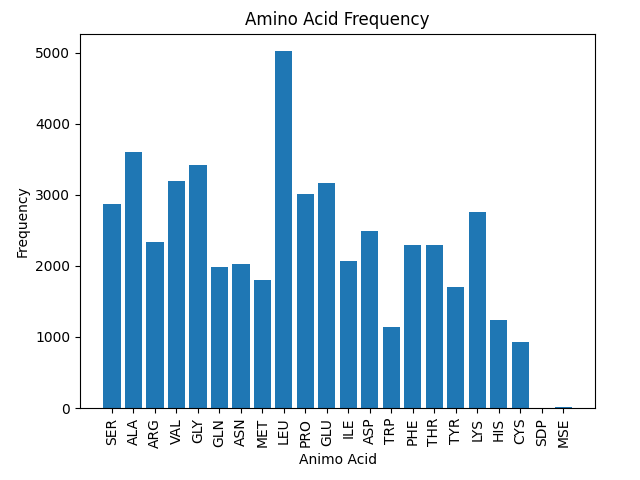
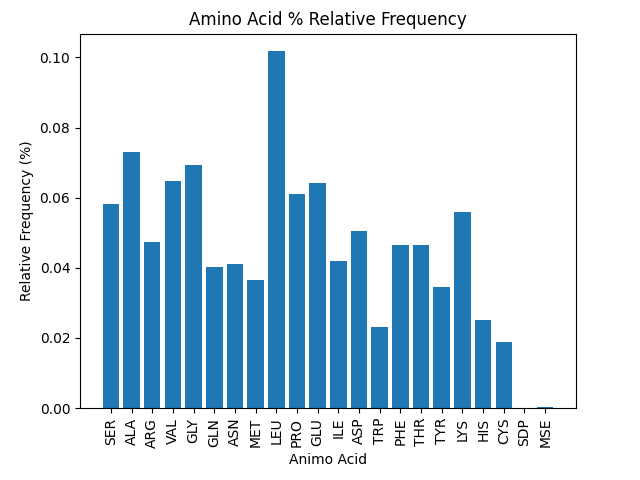

# Bioinformatics Challenge
A Python script that downloads mmCIF files for PDB IDs listed in a file and displays amino acid counts and frequencies for chains in each protein by printing and plotting (using matplotlib) both totals and relative frequencies (percentages). 

## Usage
**Download cif files and display amino acid frequencies**

`python3 src/main.py --pdb_file ./resources/file.txt`

where `./resources/file.txt` is the relative path to the file of PDB IDs separated by new lines

**Display amino acid frequencies (cif files already downloaded)**

`python3 src/main.py`

where cif files are already loaded in `resources/cif`

## Dependencies
- requests (2.26.0)
- matplotlib (3.5.1)
- gemmi (0.5.1)
- argparse (1.4.0)

## Notes
This script was created for UT graduate student Danny Diaz, lead of the computational arm of the Ellington lab. 

One change that could be made with this script is downloading gzipped cif files (instead of uncompressed) and using another dependency to uncompress them. Gemmi claims to automatically uncompress gzipped cif files, however, this functionality appears to be limited (or not working) at this time.

Some code involved with counting amino acids and interpreting cif files was provided by the [gemmi documentation](https://gemmi.readthedocs.io/en/latest/cif.html#amino-acid-frequency).

## License
Work in the `src` directory is licensed under the MIT License, found in the LICENSE.txt file